# 营销素材拆解与裂变系统 — 功能说明文档

> 基于系统截图与代码实现，描述各页面功能、操作流程和核心交互。

---

## 一、系统概览

本系统面向抖音效果广告投放业务，核心能力是将优质营销素材按 **L1-L5 五层模型**拆解为可复用的骨架，通过**骨架 + 新内容**组合批量产出新素材，形成「拆解 → 骨架库 → 裂变 → 投放验证」的闭环。

**六个核心页面**：

| 页面 | 路径 | 职责 |
|------|------|------|
| 📊 数据统计 | `/dashboard` | 运营数据概览 |
| 🔍 素材拆解 | `/` | L1-L5 拆解 + AI 辅助 |
| 📦 素材库 | `/material-lib` | 素材 CRUD + 导入导出 |
| ⚡ 素材裂变 | `/fission` | 骨架 + 新内容 → 批量生成素材 |
| 🦴 骨架库 | `/skeleton-lib` | 骨架管理 + 效果排行 |
| 📋 裂变记录 | `/fission-records` | 裂变产出管理 + 效果录入 |

另有**系统管理**页面：选项管理、标签管理、操作日志。

---

## 二、页面功能详解

### 1. 📊 数据统计（Dashboard）

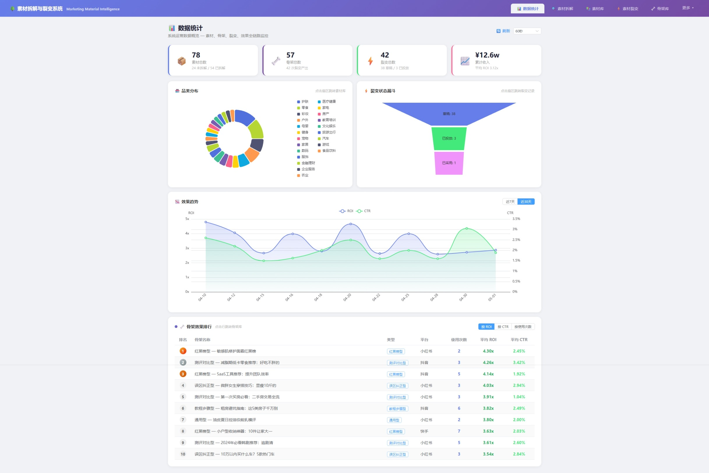

**功能**：系统运营数据全链路监控。

**核心指标**（顶部 4 张概览卡）：
- **素材总数** — 含未拆解 / 已拆解数量
- **骨架总数** — 含累计裂变产出次数
- **裂变总数** — 含草稿 / 已投放数量
- **累计收入** — 含平均 ROI

**图表区**：
- **品类分布饼图** — 按品类统计素材数量，点击扇区可跳转素材库
- **裂变状态漏斗** — 草稿 → 待审核 → 已采用 → 已投放
- **效果趋势折线图** — 近 7 天 / 近 30 天 ROI + CTR 趋势

**骨架效果排行榜**：按 ROI / CTR / 使用次数排序，点击行跳转骨架库详情。

**自动刷新**：支持关闭 / 30秒 / 60秒 / 5分钟。

---

### 2. 🔍 素材拆解（Dismantle）

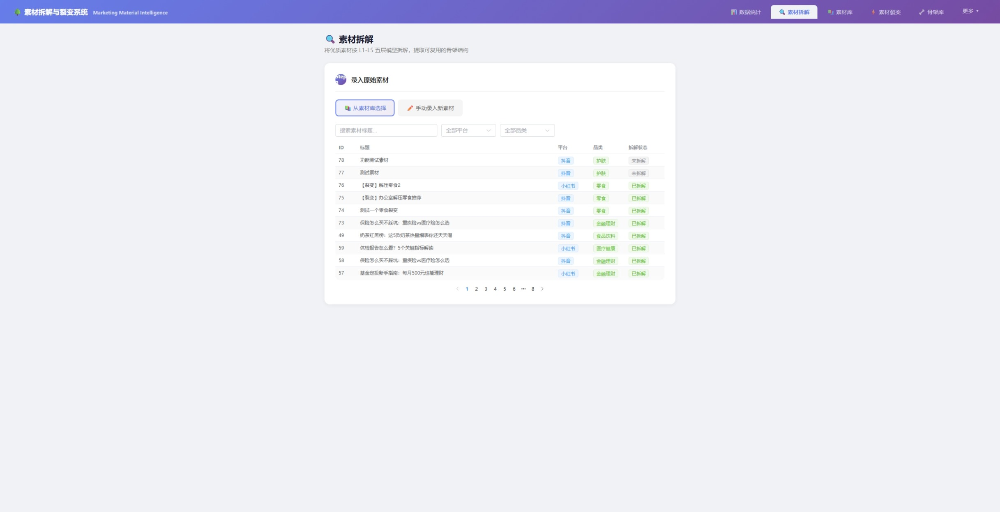

**功能**：对原始素材进行 L1-L5 五层拆解，支持 AI 智能拆解自动填充。

**操作流程**（Step 0 → Step 1）：

**Step 0 — 录入原始素材**：
- **从素材库选择**：搜索框 + 平台/品类筛选，点击行选中后确认
- **手动录入新素材**：填写标题、平台、品类、素材内容

**Step 1 — L1-L5 拆解**：

| 层级 | 名称 | 字段 |
|------|------|------|
| L1 | 主题层 | 主题、核心卖点 |
| L2 | 策略层 | 策略标签（多选）、情绪策略 |
| L3 | 结构层 | 段落列表（名称 / 功能 / 占比 / 句式模板），占比合计校验（需=100%） |
| L4 | 元素层 | 标题公式、钩子句式、转折方式、互动设计 |
| L5 | 表达层 | 金句、数据引用、视觉描述（均支持多选 + 手动输入） |

**✨ AI 智能拆解**：
- 点击按钮后调用 LongCat AI，自动分析素材标题和内容
- 拆解结果自动填充到 L1-L5 所有字段
- 显示检测到的结构类型和品类
- 支持 AI 拆解后手动修正

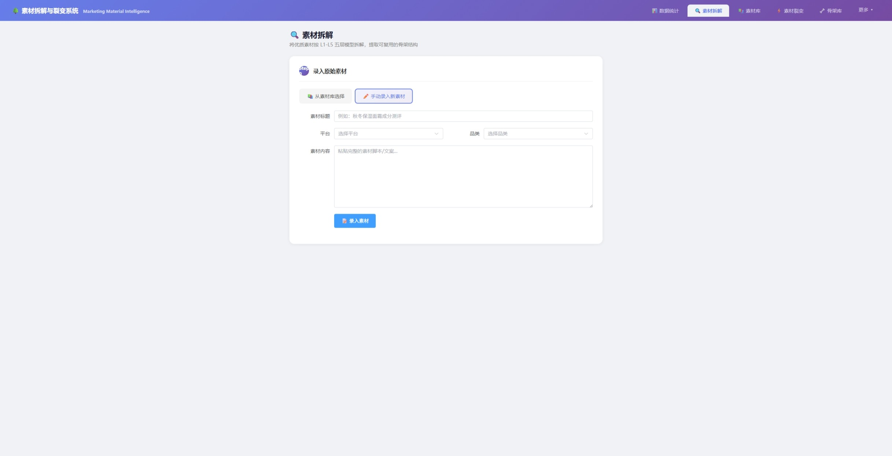

**已有拆解的查看模式**：
- 展示完整 L1-L5 数据
- 支持「编辑拆解」「提取骨架」「历史版本」操作

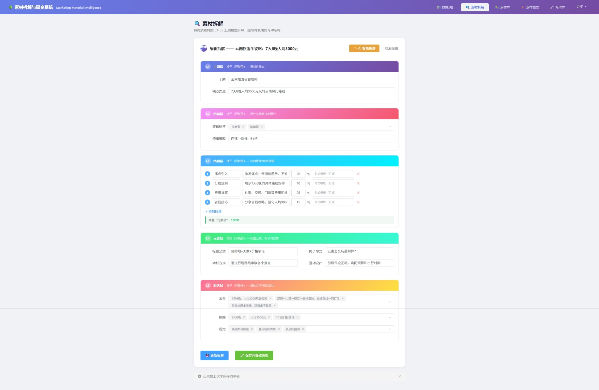

**其他功能**：
- **草稿自动保存**：表单变化自动写入 localStorage，48 小时内恢复
- **历史版本**：查看所有拆解版本，支持恢复
- **保存并提取骨架**：一键拆解 + 提取骨架

---

### 3. 📦 素材库（MaterialLib）

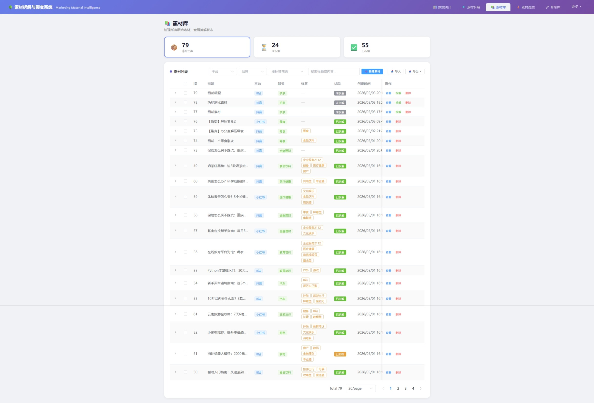

**功能**：素材的增删改查、导入导出、标签管理。

**核心功能**：
- **列表视图**：展示 ID、标题、平台、品类、拆解状态
- **搜索筛选**：关键词 + 平台 + 品类 + 状态多条件组合
- **新增素材**：标题、平台、品类、内容
- **编辑/删除**：行内操作
- **导入/导出**：JSON 格式批量导入导出
- **标签管理**：为素材添加/移除标签
- **跳转拆解**：点击「拆解」按钮直接跳转拆解页面

---

### 4. ⚡ 素材裂变（Fission）

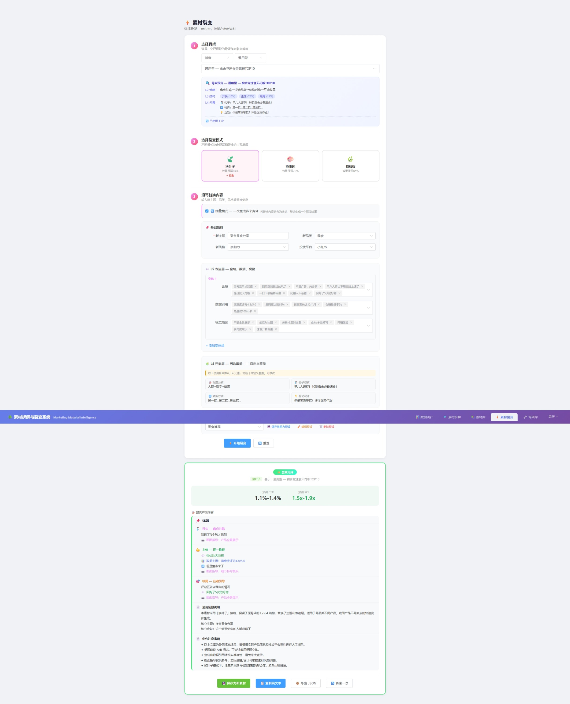

**功能**：选择骨架 + 新内容，批量产出新素材文案。

**操作流程**（Step 1 → Step 2 → Step 3）：

**Step 1 — 选择骨架**：
- 按平台/类型筛选
- 骨架预览面板：展示 L2 策略、L3 结构、L4 元素、效果统计（ROI / CTR / 使用次数）

**Step 2 — 选择裂变模式**：

| 模式 | 图标 | 说明 | 效果保留 |
|------|------|------|---------|
| 换叶子 | 🍃 | 替换 L1+L5，骨架不变 | ~85% |
| 换枝杈 | 🌿 | 替换 L3+L4，主题不变 | ~65% |
| 换表达 | 🎨 | 替换 L2+L5，骨架不变 | ~70% |

**Step 3 — 填写替换内容**：
- **基础信息**：新主题（必填）、新品类、新风格、投放平台
- **L5 表达层**：金句、数据引用、视觉描述（支持多选 + 手动输入）
- **L4 元素层**：可选覆盖钩子句式、转折方式、互动设计
- **L3 结构替换**（仅换枝杈模式）：自定义段落名称、功能、占比

**批量模式**：一键生成多个变体，每组替换内容独立生成一份裂变结果。

**效果预测**：基于母体骨架的历史平均效果 × 裂变模式系数，预测 CTR 和 ROI 区间。

---

### 5. 🦴 骨架库（SkeletonLib）

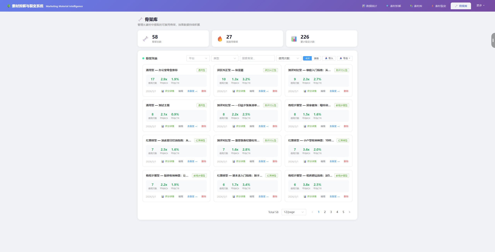

**功能**：管理从拆解记录中提取的可复用骨架。

**核心功能**：
- **列表视图**：骨架名称、类型、平台、使用次数、平均 ROI / CTR
- **搜索筛选**：关键词 + 平台 + 类型
- **详情查看**：L1-L5 完整数据 + 关联素材 + 裂变记录

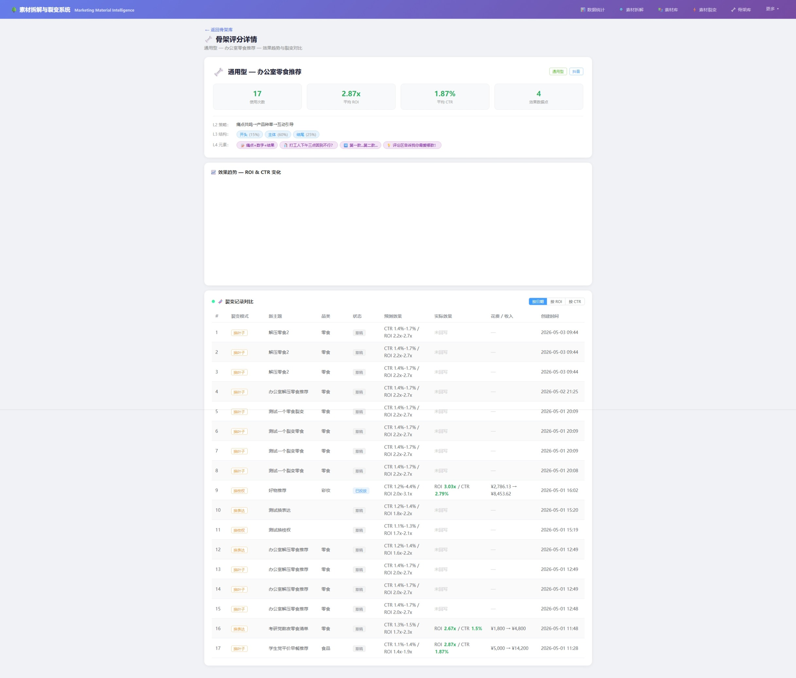

**详情面板**：
- 骨架基本信息（名称、类型、平台、来源）
- L1-L5 完整结构数据
- 效果统计（平均 ROI / CTR、使用次数）
- 关联裂变记录列表
- 操作：编辑 / 删除 / 从骨架发起裂变

---

### 6. 📋 裂变记录（FissionRecords）

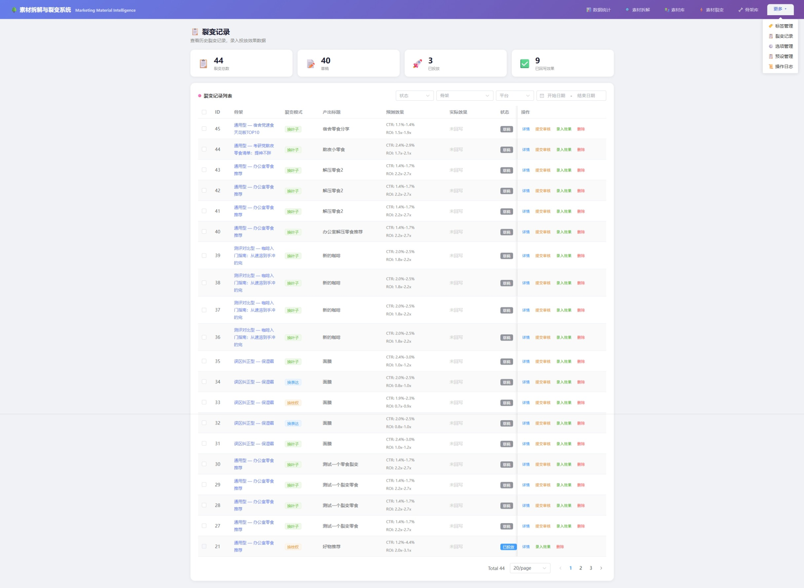

**功能**：管理裂变产出的素材，支持效果数据录入。

**核心功能**：
- **列表视图**：产出标题、骨架、裂变模式、状态、预测效果
- **状态流转**：草稿 → 待审核 → 已采用 → 已投放（每次只能推进一个状态，不可回退）
- **效果录入**：录入实际 CTR、ROI、CVR 等投放数据
- **详情查看**：完整产出内容 + 预测 vs 实际效果对比

**效果数据字段**：曝光量、点击量、CTR、转化量、CVR、消耗、收入、ROI、CPA。

---

### 7. 🎯 裂变预设（FissionPreset）

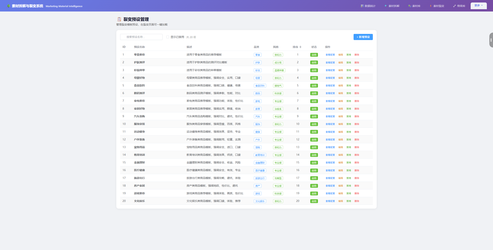

**功能**：保存常用的裂变配置（骨架 + 模式 + 替换内容模板），快速复用。

**核心功能**：
- 预设列表：名称、关联骨架、裂变模式、使用次数
- 预设详情：完整配置 + 关联裂变记录
- 创建/编辑/删除预设
- 从预设一键发起裂变

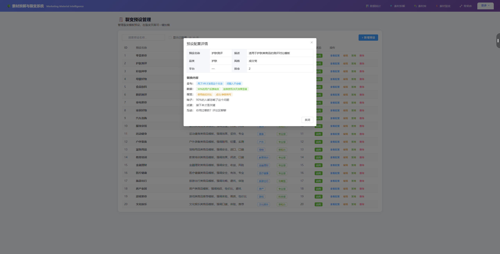

---

### 8. 🏷️ 标签管理（TagManage）

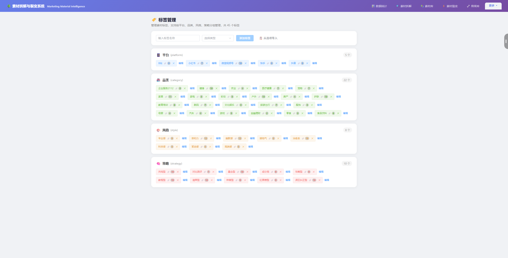

**功能**：管理素材标签体系。

**核心功能**：
- 标签列表：名称、颜色、关联素材数量
- 创建/编辑/删除标签
- 标签与素材的关联管理
- 从已有选项快速创建标签

---

## 三、数据流转全链路

```
原始素材 → [拆解引擎] → L1-L5 结构化数据
                              ↓
                       [提取骨架] → 骨架库（L2-L4 可复用）
                              ↓
                       [裂变引擎] → 骨架 + 新元素 → 新素材
                              ↓
                       [投放验证] → 效果数据回写
                              ↓
                       [骨架统计更新] → avg_roi / avg_ctr 自动更新
```

---

## 四、技术要点

### 五层拆解模型

| 层级 | 名称 | 属性 | 说明 |
|------|------|------|------|
| L1 | 主题层 | 枝干（可复用） | 素材讲什么 |
| L2 | 策略层 | 枝干（可复用） | 用什么策略/情绪打动用户 |
| L3 | 结构层 | 枝干（可复用） | 内容骨架/段落逻辑 |
| L4 | 元素层 | 枝杈（可插拔） | 标题公式、钩子句式、过渡方式等 |
| L5 | 表达层 | 叶子（可替换） | 具体文字/视觉表达 |

### AI 能力

- **AI 拆解**：调用 LongCat-2.0-Preview 大模型，根据素材标题和内容自动生成 L1-L5 拆解数据
- **熔断保护**：连续失败 3 次后自动降级为规则引擎
- **LRU 缓存**：相同内容不重复调用 AI，缓存 128 条
- **规则兜底**：AI 不可用时自动降级为关键词匹配 + 模板填充

### 效果预测

- 基于母体骨架的历史平均 ROI/CTR
- 乘以裂变模式系数（换叶子 85% / 换枝杈 65% / 换表达 70%）
- 输出 ±10% 的预测区间

---

## 五、待规划功能

- **AI 裂变**：当前裂变引擎为规则模板填充，计划升级为 AI 端到端生成
- **A/B 测试管理**：多变体素材的分桶投放和效果对比
- **素材审核工作流**：多级审核 + 批注
- **投放平台对接**：抖音/小红书 API 直投
